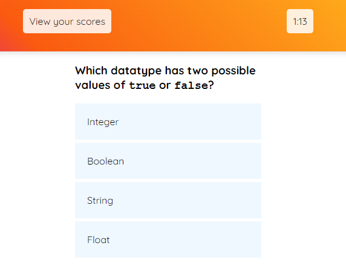

# Challenge-4: Code Quiz

[Link to deployed application](https://kieferjackson.github.io/challenge-4-code-quiz/)

## Purpose
JavaScript's built-in Web APIs enable programmers to dynamically change the content of a page by selecting and appending elements declared within JavaScript at run-time. As such, this challenge requires the ability to display interactable elements, receive user input, and keep track of certain game conditions.

## Design
Generating the user-interface (UI) elements was accomplished by using the in-built JavaScipt Web API where anything within the static "game display" element is added/removed dynamically. In order to generate questions, a "Question" class was defined to declare question objects containing the prompt, response choices, and the answer. In addition, it contains two methods which check the answer given as well as displaying the question to the page. A timer object and quiz state object were also used to track and display the time remaining, the current question, and when the quiz should end (no more questions or time remaining).

An event listener was used for detecting a user's responses to questions, but most interactable elements used the 'onclick' attribute to execute their relevant functions.

Additionally, scores can be saved locally to a user's web browser, and at any time during the quiz or after submitting a score, the user can view all previous scores saved. If the same initials are entered as a previous entry, then the previous score will be overwritten.

---

Here is a screenshot of the finished application:
    